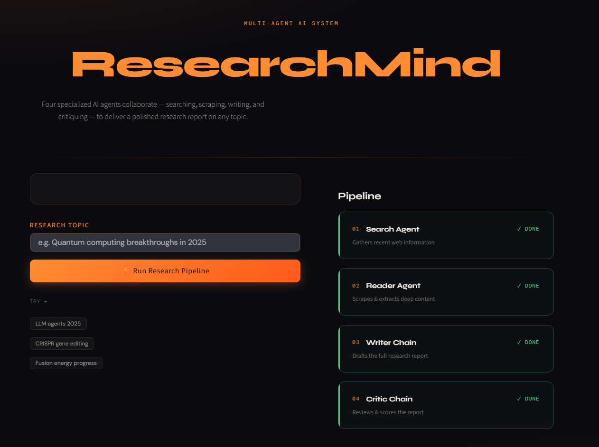

<div align="center">

<pre>
██████╗ ███████╗███████╗███████╗ █████╗ ██████╗  ██████╗██╗  ██╗
██╔══██╗██╔════╝██╔════╝██╔════╝██╔══██╗██╔══██╗██╔════╝██║  ██║
██████╔╝█████╗  ███████╗█████╗  ███████║██████╔╝██║     ███████║
██╔══██╗██╔══╝  ╚════██║██╔══╝  ██╔══██║██╔══██╗██║     ██╔══██║
██║  ██║███████╗███████║███████╗██║  ██║██║  ██║╚██████╗██║  ██║
╚═╝  ╚═╝╚══════╝╚══════╝╚══════╝╚═╝  ╚═╝╚═╝  ╚═╝ ╚═════╝╚═╝  ╚═╝
                                                    M I N D
</pre>

### *Four AI agents. One research report. ~10 seconds.*

<br/>

[](https://python.org)
[](https://langchain.com)
[](https://langchain-ai.github.io/langgraph/)
[](https://deepmind.google/technologies/gemini/)
[](https://shrutis-multi-agent-research.streamlit.app/)

<br/>



### 🔗 [**Try the live demo →**](https://shrutis-multi-agent-research.streamlit.app/)

<br/>
<br/>

</div>

---

## What is ResearchMind?

**ResearchMind** is a multi-agent AI system that autonomously researches any topic on the web and produces a structured, critic-reviewed report.

You type a topic. Four specialized agents take over:

```
  You  ──▶  Search Agent  ──▶  Reader Agent  ──▶  Writer Chain  ──▶  Critic Chain  ──▶  Report
             (DuckDuckGo)      (BeautifulSoup)      (Gemini LLM)        (Gemini LLM)
```

No manual browsing. No copy-pasting. Just research.

---

## The Pipeline

### `01` · Search Agent
Queries DuckDuckGo for the 5 most relevant, recent results on your topic. Returns titles, URLs, and content snippets.

### `02` · Reader Agent
Picks the most relevant URL from the search results and deep-scrapes it using BeautifulSoup — stripping nav, scripts, and noise to extract clean, dense content.

### `03` · Writer Chain
A Gemini-powered chain that synthesizes the search results + scraped content into a full structured report with an Introduction, Key Findings, Conclusion, and Sources.

### `04` · Critic Chain
A second Gemini chain that reviews the report like a harsh editor — scores it out of 10, highlights strengths, flags weaknesses, and delivers a one-line verdict.

---

## Tech Stack

| Layer | Technology |
|---|---|
| **LLM** | Google Gemini 2.5 Flash |
| **Agent Framework** | LangGraph (`create_react_agent`) |
| **Chains & Prompts** | LangChain Core |
| **Web Search** | DuckDuckGo Search (`ddgs`) |
| **Web Scraping** | BeautifulSoup4 + Requests |
| **UI** | Streamlit |
| **Config** | python-dotenv / Streamlit Secrets |

---

## Project Structure

```
multi-agent-research-system/
│
├── app.py               # Streamlit UI — pipeline orchestration & display
├── agents.py            # Agent & chain definitions (Search, Reader, Writer, Critic)
├── pipeline.py          # CLI pipeline runner (run without UI)
├── tools.py             # LangChain tools: web_search, scrape_url
├── requirements.txt     # Dependencies
├── assets/
│   └── screenshot.png   # UI screenshot (used in README)
└── .env                 # API keys (not committed)
```

---

## Getting Started

### 1 · Clone the repo

```bash
git clone https://github.com/shrutisingh004/multi-agent-research-system.git
cd multi-agent-research-system
```

### 2 · Install dependencies

```bash
pip install -r requirements.txt
```

### 3 · Set your API key

Create a `.env` file in the root:

```env
GOOGLE_API_KEY = your_gemini_api_key_here
```

> Get a free Gemini API key at [aistudio.google.com](https://aistudio.google.com)

### 4 · Run the app

```bash
streamlit run app.py
```

Or run it in the terminal without the UI:

```bash
python pipeline.py
```

---

## Streamlit Cloud Deployment

1. Push your repo to GitHub
2. Go to [share.streamlit.io](https://share.streamlit.io) and connect your repo
3. In **Settings → Secrets**, add:

```toml
GOOGLE_API_KEY = "your_gemini_api_key_here"
```

4. Deploy

> **Live app:** [shrutis-multi-agent-research.streamlit.app](https://shrutis-multi-agent-research.streamlit.app/)

---

## Example Output

```
Topic: "Breakthroughs in fusion energy 2025"

────────────────────────────────────────
  FINAL REPORT
────────────────────────────────────────
  1. Introduction
     Fusion energy has seen remarkable progress in 2025...

  2. Key Findings
     ▸ NIF achieved a second consecutive ignition milestone...
     ▸ Commonwealth Fusion's SPARC magnet hit record field strength...
     ▸ Private investment in fusion surpassed $10B globally...

  3. Conclusion
     The path to commercial fusion is narrowing rapidly...

  4. Sources
     • https://science.org/...
     • https://nature.com/...

────────────────────────────────────────
  CRITIC SCORE: 8/10
  "Comprehensive and well-sourced — minor gaps in policy context."
────────────────────────────────────────
```

---

## Architecture Decisions

**Why LangGraph over vanilla LangChain agents?**
LangGraph's `create_react_agent` gives fine-grained control over the tool-calling loop, making agents more reliable and debuggable than legacy `AgentExecutor`.

**Why two separate chains for Writer and Critic?**
Separation of concerns. The Critic needs to evaluate the report without being biased by the writing context — a clean prompt boundary produces more honest scores.

**Why Gemini 2.5 Flash?**
Best-in-class speed-to-quality ratio for agentic tasks. Handles long scraped content well and is free-tier friendly for experimentation.

---

<div align="center">

*Built with LangChain · LangGraph · Google Gemini · Streamlit*

</div>
